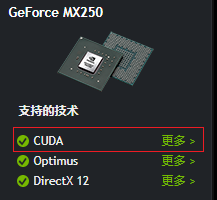
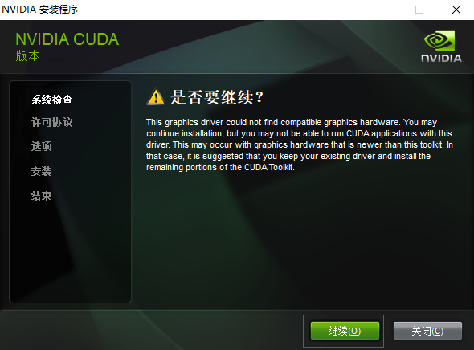
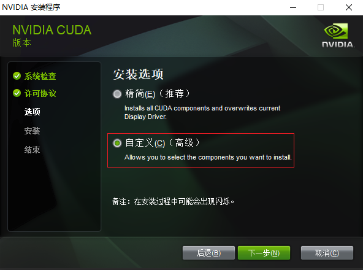
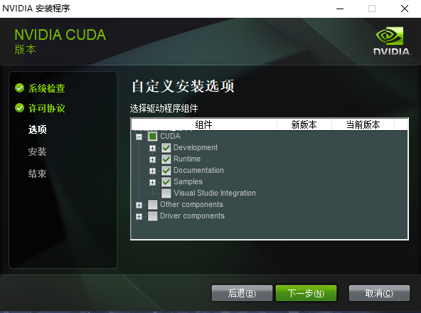
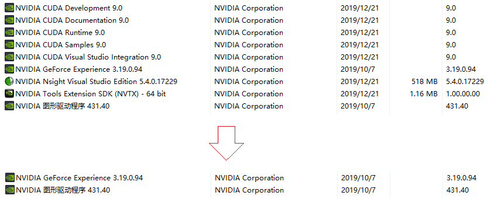

# GPU 运算


## 环境推荐

- [Python3.6.8](https://www.python.org/downloads/release/python-368/)
- [CUDA Toolkit 9.0](https://developer.nvidia.com/cuda-90-download-archive)
- [cuDNN](https://developer.nvidia.com/rdp/cudnn-archive)
- `pip install tensorflow-gpu==1.8.0`

## 硬件

- [CUDA-Z](./packages/CUDA-Z-0.10.251-32bit.exe)
- [GPU-Z](./packages/GPU-Z.2.26.0.exe)
- [NVIDA Drivers](https://www.nvidia.com/Download/index.aspx)

**查看您的GPU是否在此列表中（旧显卡）**

  - [CUDA-GPUS](https://developer.nvidia.com/cuda-gpus)

**直接查看GPU是否支持CUDA（新显卡）**

- [](https://www.geforce.cn/hardware/notebook-gpus/geforce-mx250/specifications)
- [Notebook GPU Specifications](https://www.geforce.cn/hardware/notebook-gpus)
- [Desktop GPU Specifications](https://www.geforce.cn/hardware/desktop-gpus)

## 安装

> 下载cuDNN需要登录帐号
<!--
    707215825@qq.com
    ZHmh542761
-->
- [Download CUDA Toolkit Archive](https://developer.nvidia.com/cuda-toolkit-archive)
- [Download cuDNN Archive](https://developer.nvidia.com/rdp/cudnn-archive)
- 
- 
- 

>将 **CUDA**、**CUPTI** 和 **cuDNN** 安装目录添加到 `%PATH%` 环境变量中。
>- 将 **CUDA**  安装到 `C:\Program Files\NVIDIA GPU Computing Toolkit\CUDA\v9.0`；
>- 将 **cuDNN** 安装到 `C:\Program Files\NVIDIA GPU Computing Toolkit\cuDNN\for9.0`。

```batch
REM 更新环境变量
SET NVIDIA_GPU_CT_PATH=C:\Program Files\NVIDIA GPU Computing Toolkit
SET PATH=%NVIDIA_GPU_CT_PATH%\CUDA\9.0\bin;%PATH%
SET PATH=%NVIDIA_GPU_CT_PATH%\CUDA\v9.0\extras\CUPTI\libx64;%PATH%
SET PATH=%NVIDIA_GPU_CT_PATH%\CUDA\v9.0\include;%PATH%
SET PATH=%NVIDIA_GPU_CT_PATH%\cuDNN\for9.0;%PATH%
```

### 卸载

- 

## Tensorflow

- [Download Tensorflow (aliyun)](http://mirrors.aliyun.com/pypi/simple/tensorflow-gpu/)
- [Download Tensorflow (pypi)](https://pypi.org/project/tensorflow-gpu/#history)
- [Source Build](https://www.tensorflow.org/install/source_windows)


| tensorflow-gpu | python | cuDNN | CUDA |
| :-: | :-: | :-: | :-: |
|
| 2 | 3.5-3.7 | 7.4 | 10.0
| 1.14 | 3.5-3.7 | 7.4 | 10.0
| 1.13 | 3.5-3.7 | 7.4 | 10.0
|
| 1.12 | 3.5-3.6 | 7 | 9
| 1.11 | 3.5-3.6 | 7 | 9
| 1.10 | 3.5-3.6 | 7 | 9
| 1.9  | 3.5-3.6 | 7 | 9
| 1.8  | 3.5-3.6 | 7 | 9
| 1.7  | 3.5-3.6 | 7 | 9
| 1.6  | 3.5-3.6 | 7 | 9
| 1.5  | 3.5-3.6 | 7 | 9
|
| 1.4  | 3.5-3.6 | 6 | 8
| 1.3  | 3.5-3.6 | 6 | 8
|
| 1.2  | 3.5-3.6 | 5.1 | 8
| 1.1  | 3.5     | 5.1 | 8
| 1.0  | 3.5     | 5.1 | 8

## PyTorch

- [Download PyTorch WHL](https://download.pytorch.org/whl/torch_stable.html)
- [Get-Started](https://pytorch.org/get-started/locally/)