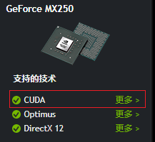
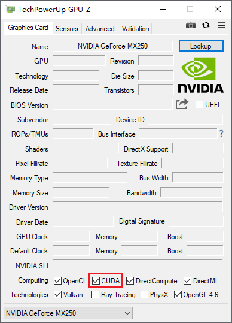
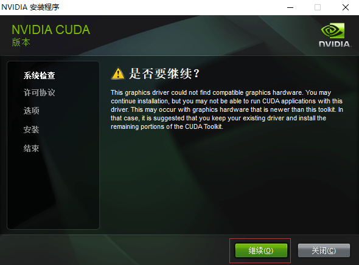
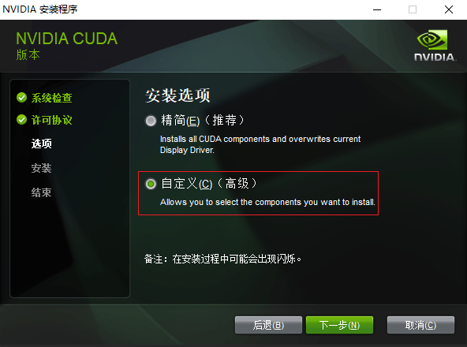
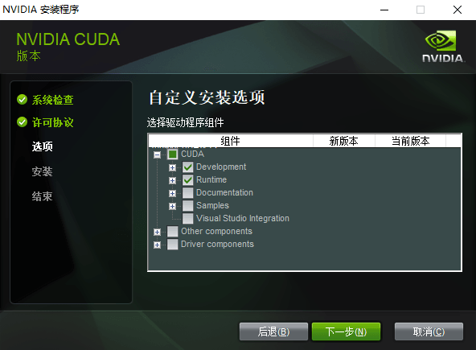
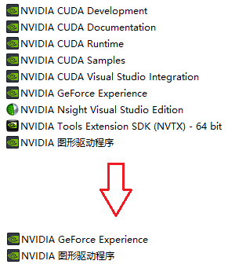

<link rel="stylesheet" href="https://zhmhbest.gitee.io/hellomathematics/style/index.css">
<script src="https://zhmhbest.gitee.io/hellomathematics/style/index.js"></script>

# [CUDA](https://github.com/zhmhbest/HelloCUDA)

[TOC]

## 推荐环境

### 环境1

- [Python 3.6.8](https://www.python.org/downloads/release/python-368/)
- [CUDA 9.0](https://developer.nvidia.com/cuda-90-download-archive)
- [`pip install numpy==1.16.4`](https://pypi.org/project/numpy/1.16.4/)
- [`pip install tensorflow-gpu==1.8.0`](https://pypi.org/project/tensorflow-gpu/1.8.0/)

### 环境2

- [Python 3.7.6](https://www.python.org/downloads/release/python-376/)
- [CUDA 10.0](https://developer.nvidia.com/cuda-10.0-download-archive)
- [`pip install numpy==1.16.4`](https://pypi.org/project/numpy/1.16.4/)
- [`pip install tensorflow-gpu==1.14.0`](https://pypi.org/project/tensorflow-gpu/1.14.0/)

## 硬件

### 硬件驱动

- [NVIDA Drivers](https://www.nvidia.com/Download/index.aspx)

### 硬件支持

- 查看您的GPU是否在[CUDA-GPUS](https://developer.nvidia.com/cuda-gpus)中（部分旧显卡）
- 直接查看GPU是否支持CUDA（部分新显卡）
  - [Notebook GPU Specifications](https://www.geforce.cn/hardware/notebook-gpus)
  - [Desktop GPU Specifications](https://www.geforce.cn/hardware/desktop-gpus)
- 使用[GPU-Z](https://www.techpowerup.com/download/techpowerup-gpu-z/)查看显卡是否支持CUDA

<span class='highlight'>以上条件任意满足其一，即代表显卡支持CUDA。

#### 例

- [](https://www.geforce.cn/hardware/notebook-gpus/geforce-mx250/specifications)
- 

## 下载

> 下载cuDNN需要登录帐号

<!--
    707215825@qq.com
    ZHmh542761
-->

- [Download CUDA Toolkit Archive](https://developer.nvidia.com/cuda-toolkit-archive)
- [Download cuDNN Archive](https://developer.nvidia.com/rdp/cudnn-archive)

## 安装

### 安装CUDA

- 
- 
- 

CUDA最终将位于`C:\Program Files\NVIDIA GPU Computing Toolkit\CUDA\v?.?`

### 安装cuDNN

将cuDNN压缩包直接展开到`C:\Program Files\NVIDIA GPU Computing Toolkit\CUDA\v?.?`下，即cuDNN的`bin`目录最终将位于`C:\Program Files\NVIDIA GPU Computing Toolkit\CUDA\v?.?\cuda\bin`。

### 配置环境变量

需要将 **CUDA**、**CUPTI** 和 **cuDNN** 目录添加到 `%PATH%` 环境变量中。

```batch
REM SET CUDA_VERSION=v10.1
REM SET CUDA_PATH=%ProgramFiles%\NVIDIA GPU Computing Toolkit\CUDA\%CUDA_VERSION%
IF DEFINED CUDA_PATH (
    SET CUDA_PATH_BK=%CUDA_PATH%
    SET CUDA_PATH=
)
IF DEFINED CUDA_PATH_BK (
    SETX CUDA_ENV "%CUDA_PATH%\bin;%CUDA_PATH%\extras\CUPTI\libx64;%CUDA_PATH%\cuda\bin"
    REM SETX CUDA_ENV "%CUDA_PATH%\bin;%CUDA_PATH%\lib;%CUDA_PATH%\libnvvp;%CUDA_PATH%\extras\CUPTI\libx64;%CUDA_PATH%\include;%CUDA_PATH%\cuda\bin"
)
REM ECHO %CUDA_ENV%
REM 然后手动将CUDA_ENV加入PATH中
```

### 卸载

- 

## Tensorflow

- [Download Tensorflow (aliyun)](http://mirrors.aliyun.com/pypi/simple/tensorflow-gpu/)
- [Download Tensorflow (pypi)](https://pypi.org/project/tensorflow-gpu/#history)
- [Tensorflow Windows Build GPU](https://tensorflow.google.cn/install/source_windows#gpu)
- [Tensorflow GPU Config](https://tensorflow.google.cn/install/gpu)

## PyTorch

- [Download PyTorch WHL](https://download.pytorch.org/whl/torch_stable.html)
- [Get-Started](https://pytorch.org/get-started/locally/)
