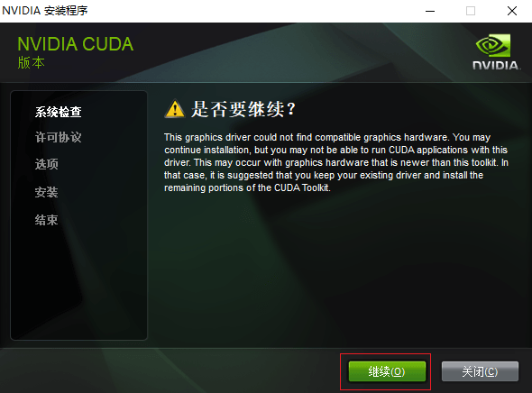

<link rel="stylesheet" href="https://zhmhbest.gitee.io/hellomathematics/style/index.css">
<script src="https://zhmhbest.gitee.io/hellomathematics/style/index.js"></script>

# [CUDA](https://github.com/zhmhbest/HelloCUDA)

[TOC]

## 硬件

### 硬件驱动

- [NVIDA Drivers](https://www.nvidia.com/Download/index.aspx)

### 硬件支持

- 查看您的GPU是否在[CUDA-GPUS](https://developer.nvidia.com/cuda-gpus)中（部分旧显卡）
- 直接查看GPU是否支持CUDA（部分新显卡）
  - [Notebook GPU Specifications](https://www.geforce.cn/hardware/notebook-gpus)
  - [Desktop GPU Specifications](https://www.geforce.cn/hardware/desktop-gpus)
- 使用[GPU-Z](https://www.techpowerup.com/download/techpowerup-gpu-z/)查看显卡是否支持CUDA

<span class='highlight'>以上条件任意满足其一，即代表显卡支持CUDA。

#### 例

- [](https://www.geforce.cn/hardware/notebook-gpus/geforce-mx250/specifications)
- 

## 下载

> 下载cuDNN需要登录帐号

<!--
    707215825@qq.com
    ZHmh542761
-->

- [Download CUDA Toolkit Archive](https://developer.nvidia.com/cuda-toolkit-archive)
- [Download cuDNN Archive](https://developer.nvidia.com/rdp/cudnn-archive)

## 安装

### 安装CUDA

- 
- 
- 

CUDA最终将位于`C:\Program Files\NVIDIA GPU Computing Toolkit\CUDA\v?.?`

### 安装cuDNN

将cuDNN压缩包直接展开到`C:\Program Files\NVIDIA GPU Computing Toolkit\CUDA\v?.?`下，即cuDNN的`bin`目录最终将位于`C:\Program Files\NVIDIA GPU Computing Toolkit\CUDA\v?.?\cuda\bin`。

### 配置环境变量

需要将 **CUDA**、**CUPTI** 和 **cuDNN** 目录添加到 `%PATH%` 环境变量中。

```batch
@ECHO OFF
REM 更新环境变量

SET CUDA_VERSION=v9.0

::================================================

SET NVIDIA_GPU_CT_PATH=%ProgramFiles%\NVIDIA GPU Computing Toolkit
SET CUDA_PATH=%NVIDIA_GPU_CT_PATH%\CUDA\%CUDA_VERSION%
SET CUDNN_PATH=%CUDA_PATH%\cuda

::================================================

SET PATH=%CUDA_PATH%\bin;%PATH%
SET PATH=%CUDA_PATH%\extras\CUPTI\libx64;%PATH%
SET PATH=%CUDA_PATH%\include;%PATH%
SET PATH=%CUDNN_PATH%\bin;%PATH%

::================================================

@SET APPPATH=%~1
@ECHO %APPPATH%
@START "" "%APPPATH%"
```

### 卸载

- 

## Tensorflow

- [Download Tensorflow (aliyun)](http://mirrors.aliyun.com/pypi/simple/tensorflow-gpu/)
- [Download Tensorflow (pypi)](https://pypi.org/project/tensorflow-gpu/#history)
- [Tensorflow GPU](https://www.tensorflow.org/install/source_windows#gpu)

## PyTorch

- [Download PyTorch WHL](https://download.pytorch.org/whl/torch_stable.html)
- [Get-Started](https://pytorch.org/get-started/locally/)
